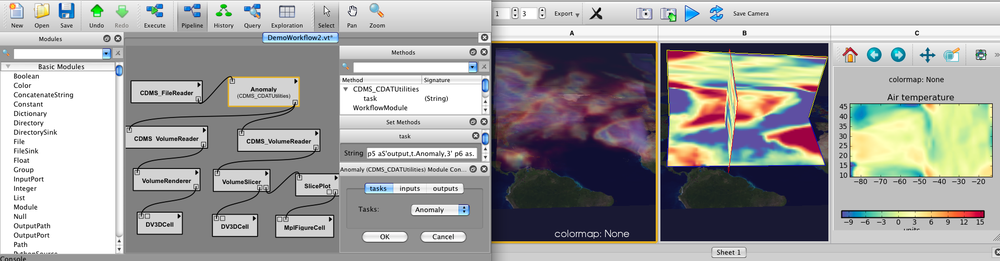

.. vtDV3D documentation master file, created by
   sphinx-quickstart on Tue May  3 16:00:12 2011.
   You can adapt this file completely to your liking, but it should at least
   contain the root `toctree` directive.

============================================
Climate Data Visualization Using vtDV3D
============================================

	**vtDV3D** is a package of VisTrails modules providing workflow interfaces for advanced visualization and analysis of climate data. 
	
==========		
Contents:
==========

.. toctree::

   introduction
   configuration
   modules
   goddard 

===================
Indices and tables
===================

* :ref:`genindex`
* :ref:`modindex`
* :ref:`search`

