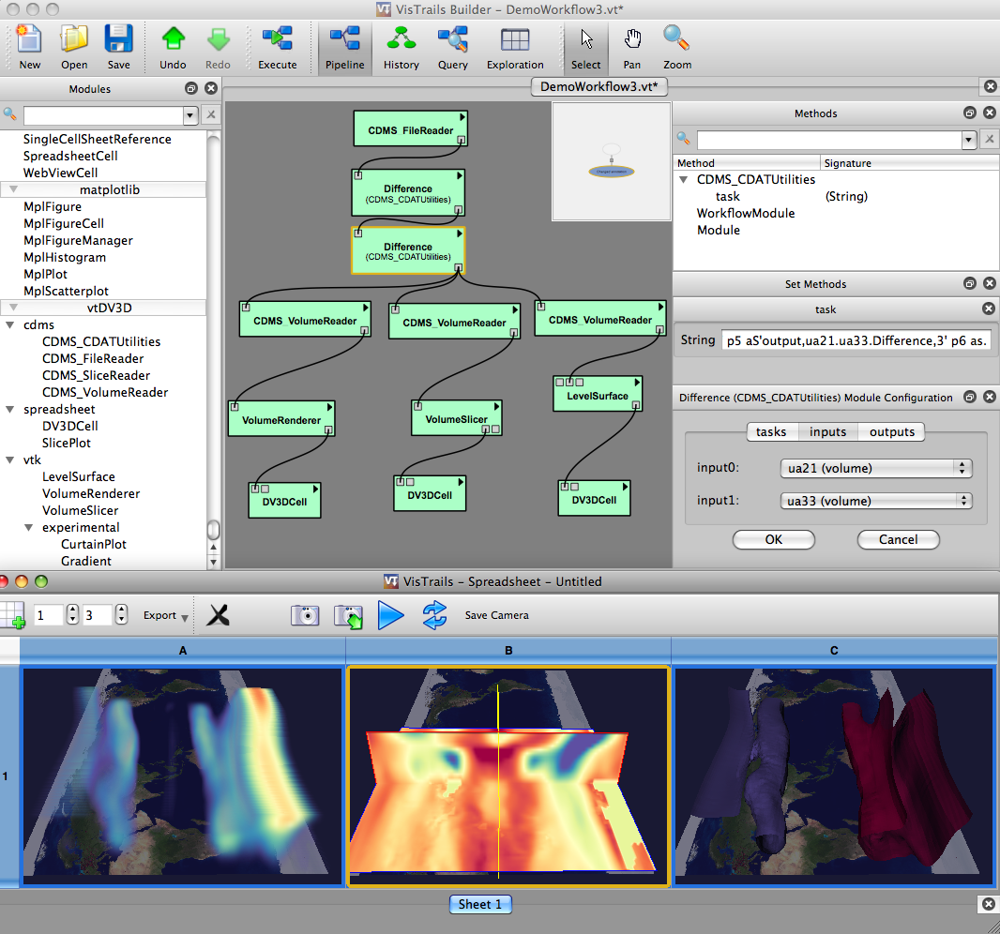

Introduction
============

.. module:: introduction
	:synopsis: Introduction to vtDV3D.
.. moduleauthor:: Thomas Maxwell <thomas.maxwell@nasa.gov>

vtDV3D
+++++++

	**vtDV3D** is a `Vistrails <http://www.vistrails.org/index.php/Main_Page>`_ package of high-level modules for `UV-CDAT <http://uv-cdat.llnl.gov/>`_, the `ESG <http://esg-pcmdi.llnl.gov/>`_ analysis framework, providing user-friendly workflow interfaces for advanced 
	visualization and analysis of climate data at a level appropriate for scientists.   This project is motivated by the observation that climate 
	scientists can greatly benefit from advanced visualization methods, but they rarely use these tools because the existing interfaces are too complex.   
	**vtDV3D**'s simple GUI interface is designed to be readily used by busy scientists who have little time to invest in learning complex new frameworks. 
	The application builds on `VTK <http://www.vtk.org/>`_, an open-source, object-oriented library, for visualization and analysis.  VTK currently has over a million lines of 
	code and is a de facto standard for the academic, industry, and research visualization communities.   	

  	**vtDV3D**'s features include:
  	
	* multiple visualization modes, including volume rendering, 2D slicing, iso-contouring, and streamlining.
	* drag slice planes along coordinate axes by default. 
	* resize & rotate slice planes using key + mouse. 
	* adjust the scaling of color maps using key + mouse drag. 
	* get coordinate & variable values using mouse picks. 
	* adjust the volume render transfer function using key + mouse drag. 
	* access custom VisTrails module guis for choosing color map, etc. 
	* Greatly simplified (with regards to VTK) workflows. 
	* multiple simultaneous synchronized visualization displays. 
	* a hyperwall mode which features a separate synchronized visualization display on each hyperwall tile.
	* hyperwall application development on the user's desktop.
	* active and passive stereo vision support (through VTK).

VisTrails
+++++++++++ 

	**vtDV3D** has been developed as a package within the `Vistrails <http://www.vistrails.org/index.php/Main_Page>`_ environment. VisTrails is a new scientific workflow management system developed at the University of Utah that provides support for data exploration and visualization. 
	
* :ref:`genindex`
* :ref:`modindex`
* :ref:`search`
